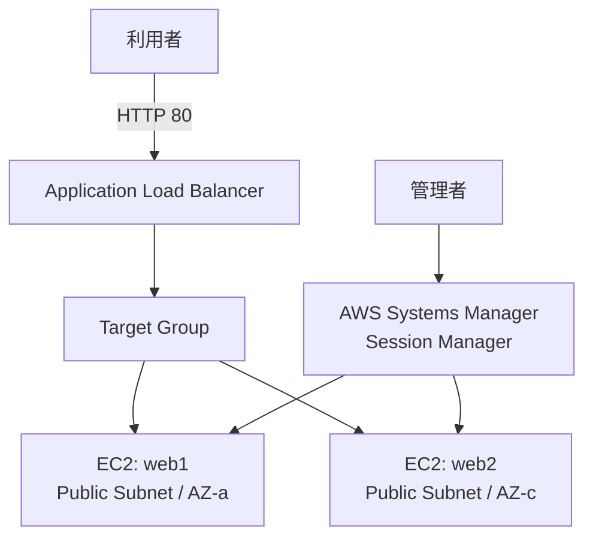
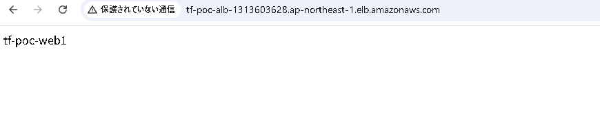
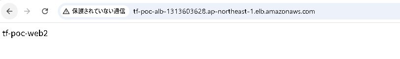

# AWS Web PoC

## 概要

AWS 上に最小構成の Web 基盤を構築し、ネットワーク、アクセス制御、ロードバランシング、および IaC の基本を確認した個人学習 PoC です。

最初に AWS マネジメントコンソールから手作業で環境を構築し、各リソースの役割と通信経路を確認しました。その後、同等の構成を別 VPC 上に Terraform で再構築し、コードによる再現性、初期設定の自動化、構築・削除までの一連の操作を検証しました。

検証完了後、作成した AWS リソースは削除済みです。

## 実施内容

- VPC / Public Subnet / Internet Gateway / Route Table の構築
- 2 つの Availability Zone への EC2 配置
- Application Load Balancer による HTTP リクエストの分散
- Security Group による通信経路の制御
- SSH ポートを開放せず、AWS Systems Manager Session Manager を利用した管理アクセス
- user data による nginx とコンテンツの自動設定
- 手作業で構築した構成の Terraform による再現
- `terraform validate` / `plan` / `apply` / `state list` / `destroy` の確認

## 構成イメージ



## 設計上のポイント

- ALB をインターネット公開の入口とした
- EC2 は学習範囲を絞るため Public Subnet に配置し、Public IP を付与した
- EC2 の HTTP 受信元は ALB 用 Security Group に限定し、インターネットから EC2 への直接 HTTP アクセスを許可しない構成とした
- SSH（22 番ポート）は開放せず、管理アクセスには Session Manager を利用した
- 手作業版と Terraform 版は VPC およびタグを分け、構築方式を識別できるようにした
- Terraform 版では EC2 2 台の初期設定を user data で自動化した

> 本 PoC は各サービスの関係を理解するための最小構成です。実運用を想定した構成では、Private Subnet、HTTPS、監視、Terraform State のリモート管理などを追加する余地があります。

## 手作業版

手作業版では、次の構成を AWS マネジメントコンソールから作成しました。

- VPC × 1
- Public Subnet × 2（2AZ）
- Internet Gateway × 1
- Public Route Table × 1
- Security Group × 2（ALB 用 / EC2 用）
- IAM Role / Instance Profile（SSM 接続用）
- EC2 × 2
- Target Group × 1
- Application Load Balancer × 1

EC2 1 台目は Session Manager から接続して nginx を手動導入し、2 台目は user data で自動構築しました。Target Group のヘルスチェックと、ALB の DNS 名経由で 2 台の Web サーバーへ到達できることを確認しました。

## Terraform 版

手作業版と同等の最小 Web 基盤を、別 VPC 上に Terraform で構築しました。

### Terraform コード

- [Terraform ディレクトリ](terraform/)

### 主なファイル

```text
terraform/
├─ versions.tf
├─ provider.tf
├─ variables.tf
├─ locals.tf
├─ vpc.tf
├─ security_groups.tf
├─ iam.tf
├─ ec2.tf
├─ alb.tf
├─ outputs.tf
├─ terraform.tfvars
└─ user_data/
   └─ nginx.sh.tftpl
```

### 実行手順

```powershell
cd terraform
terraform init
terraform fmt -recursive
terraform validate
terraform plan
terraform apply
terraform output
terraform state list
terraform destroy
```

> `terraform apply` および AWS リソースの利用には料金が発生する可能性があります。

## 検証結果

- `terraform validate` が成功することを確認
- Terraform により 20 リソースが作成されることを確認
- Target Group 配下の EC2 2 台が `healthy` になることを確認
- ALB の DNS 名へ繰り返しアクセスし、`tf-poc-web1` / `tf-poc-web2` の両方が表示されることを確認
- 主要リソースが Terraform State で管理されていることを確認
- 検証後に `terraform destroy` を実行し、20 リソースが削除されることを確認

| `tf-poc-web1` | `tf-poc-web2` |
|---|---|
|  |  |

詳細な証跡は [Terraform 版の検証結果](docs/terraform_verification.md) にまとめています。

## 関連ドキュメント

### 手作業版

- [手作業構築メモ](docs/manual_build_notes.md)
- [構成概要](docs/architecture.md)
- [動作確認結果](docs/verification.md)

### 設計・Terraform 版

- [設計判断メモ](docs/design_decisions.md)
- [Terraform 版構成概要](docs/terraform_architecture.md)
- [Terraform 版検証結果](docs/terraform_verification.md)

## 今後の改善候補

- EC2 を Private Subnet に配置し、ALB のみを Public Subnet に配置する
- ACM 証明書を利用して HTTPS 化する
- CloudWatch Metrics / Alarm による監視を追加する
- Terraform State を S3 などでリモート管理する
- CI で `terraform fmt -check` / `terraform validate` を自動実行する
- IAM、暗号化、ログ、送信方向の通信制御を含め、セキュリティ設定を強化する
