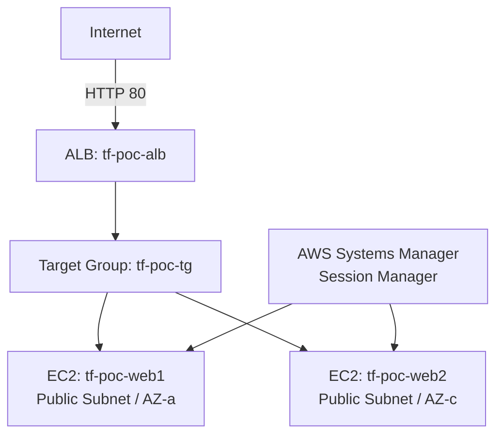

# Terraform 版 構成概要

## 1. 目的

手作業で構築した最小 Web 基盤を、Terraform を用いて別 VPC 上に再現しました。

本フェーズでは、以下を確認しました。

- AWS リソースをコードとして定義できること
- 同一コードから構成を再現できること
- user data により EC2 の初期設定を自動化できること
- Terraform State で管理対象を確認できること
- `terraform destroy` により作成リソースを削除できること

## 2. 構成方針

- 手作業版とは別の VPC を作成する
- タグで手作業版と Terraform 版を識別する
- 2 つの Availability Zone に EC2 を 1 台ずつ配置する
- ALB から Target Group を経由して EC2 2 台へ転送する
- EC2 の管理アクセスには AWS Systems Manager Session Manager を利用する
- 学習範囲とコストを抑えるため、ALB と EC2 は Public Subnet に配置する
- EC2 には Public IP を付与するが、HTTP の受信元は ALB 用 Security Group に限定する
- SSH（22）は許可しない
- EC2 2 台の nginx 設定を user data で自動化する
- Terraform State はローカル管理とし、State ファイルは Git 管理対象外とする

## 3. 構成イメージ



## 4. 構成情報

### 共通タグ

- `Project=aws-poc`
- `BuildType=terraform`

### VPC

- Name: `tf-poc-vpc`
- CIDR: `10.1.0.0/16`

### Public Subnet

- `tf-poc-public-subnet-a`
  - CIDR: `10.1.1.0/24`
  - AZ: `ap-northeast-1a`
- `tf-poc-public-subnet-c`
  - CIDR: `10.1.2.0/24`
  - AZ: `ap-northeast-1c`

### Internet 接続

- Internet Gateway: `tf-poc-igw`
- Route Table: `tf-poc-public-rt`
- Default route: `0.0.0.0/0 -> Internet Gateway`
- Public Subnet での Public IP 自動割り当て: 有効

### Security Group

#### ALB 用

- Name: `tf-poc-alb-sg`
- Inbound:
  - HTTP 80 from `0.0.0.0/0`
- Outbound:
  - all traffic

#### EC2 用

- Name: `tf-poc-ec2-sg`
- Inbound:
  - HTTP 80 from `tf-poc-alb-sg`
- Outbound:
  - all traffic

EC2 用 Security Group に SSH の Inbound Rule は定義していません。

### IAM

- Role: `tf-poc-ec2-role`
- Instance Profile: `tf-poc-ec2-profile`
- Attached Policy:
  - `AmazonSSMManagedInstanceCore`

### EC2

- `tf-poc-web1`
  - Subnet: `tf-poc-public-subnet-a`
  - OS: Amazon Linux 2023
  - Web server: nginx
  - Initial configuration: user data
- `tf-poc-web2`
  - Subnet: `tf-poc-public-subnet-c`
  - OS: Amazon Linux 2023
  - Web server: nginx
  - Initial configuration: user data

### Load Balancer

- ALB: `tf-poc-alb`
- Scheme: `internet-facing`
- Listener: HTTP 80
- Target Group: `tf-poc-tg`
- Target type: Instance
- Health check:
  - Protocol: HTTP
  - Path: `/`
  - Matcher: `200`

## 5. Terraform ディレクトリ構成

```text
terraform/
├─ versions.tf
├─ provider.tf
├─ variables.tf
├─ locals.tf
├─ vpc.tf
├─ security_groups.tf
├─ iam.tf
├─ ec2.tf
├─ alb.tf
├─ outputs.tf
├─ terraform.tfvars
└─ user_data/
   └─ nginx.sh.tftpl
```

## 6. ファイル分割方針

小規模な学習用構成のため module 化は行わず、ルートモジュール内で責務ごとにファイルを分割しました。

- `versions.tf`: Terraform / Provider のバージョン制約
- `provider.tf`: AWS Provider 設定
- `variables.tf`: 入力変数
- `locals.tf`: 共通タグなどの共通値
- `vpc.tf`: VPC / Subnet / Internet Gateway / Route Table
- `security_groups.tf`: ALB / EC2 の通信制御
- `iam.tf`: EC2 が Session Manager を利用するための IAM
- `ec2.tf`: Web サーバー 2 台
- `alb.tf`: ALB / Target Group / Listener
- `outputs.tf`: 構築後の確認用出力

## 7. user data の方針

EC2 2 台とも user data により nginx を自動導入しました。サーバーごとに識別名を渡し、`index.html` の内容を変えています。

user data で実施する内容:

- nginx のインストール
- nginx の自動起動設定
- nginx の起動
- `index.html` へのサーバー識別名の書き込み

これにより、再構築時にも同一の初期設定を自動適用できます。

## 8. アクセス経路

### 利用者

```text
Internet -> ALB -> Target Group -> EC2
```

### 管理者

```text
AWS Systems Manager Session Manager -> EC2
```

## 9. 検証後の状態

検証後に `terraform destroy` を実行し、Terraform で作成した 20 リソースが削除されることを確認しました。現在、検証用リソースは削除済みです。

## 10. 今後の改善候補

- EC2 を Private Subnet に配置し、ALB のみを Public Subnet に配置する
- ACM を利用して HTTPS 化する
- CloudWatch Metrics / Alarm を追加する
- Terraform State を S3 などでリモート管理する
- CI で Terraform の静的チェックを実行する
- IAM、暗号化、ログ、送信方向の通信制御を含めてセキュリティを強化する
