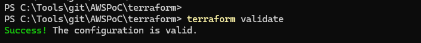
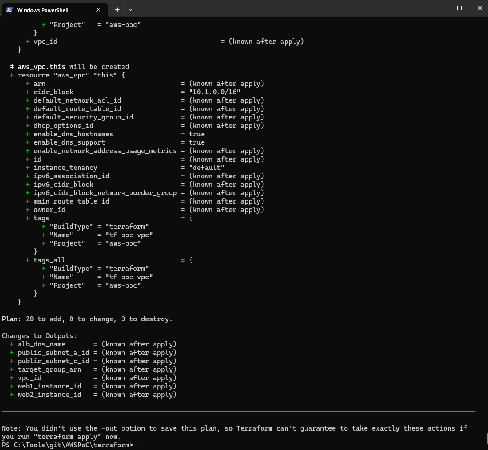
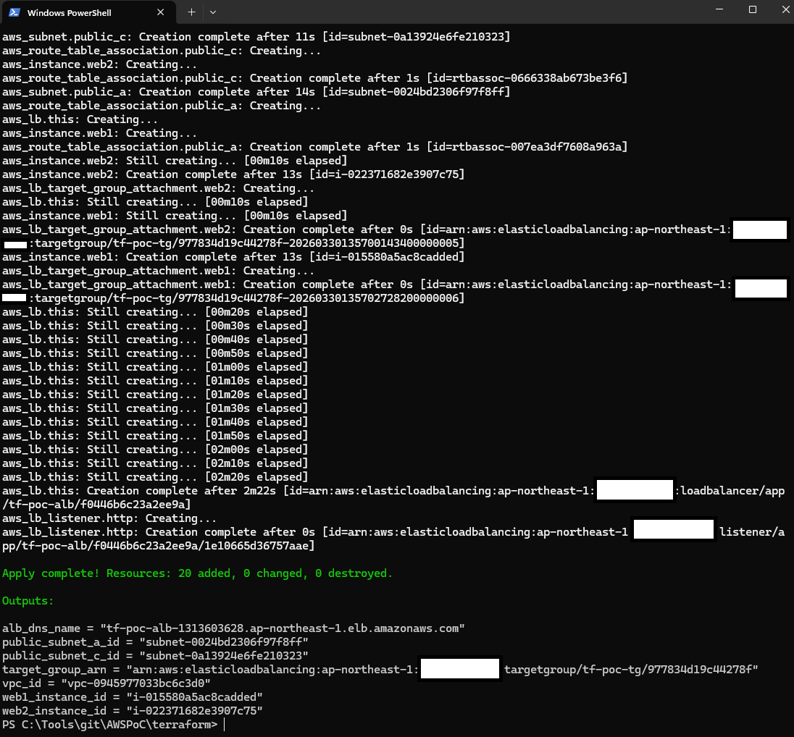
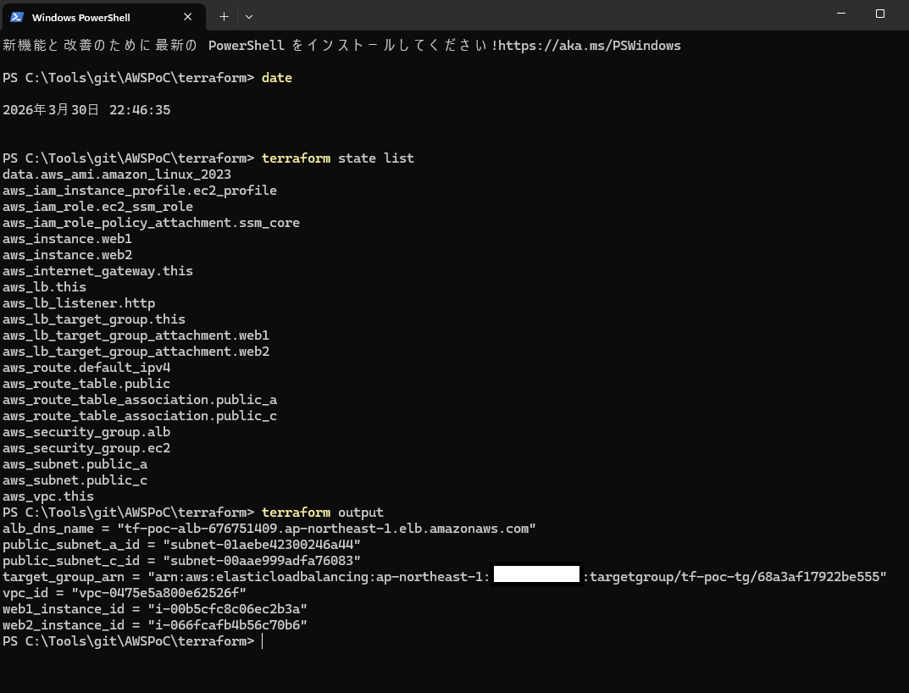
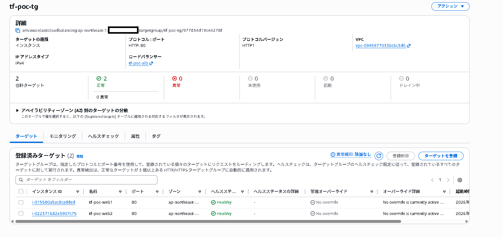
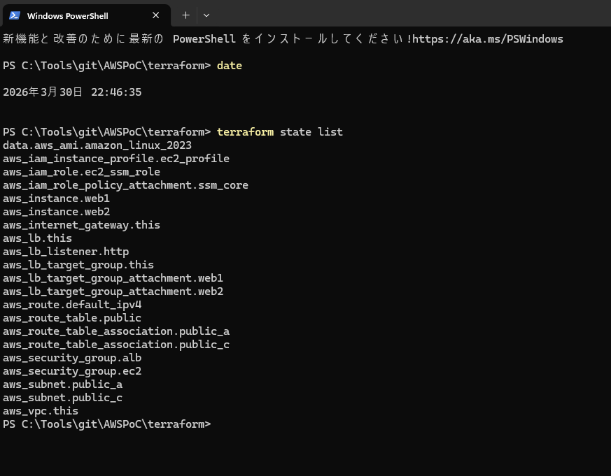
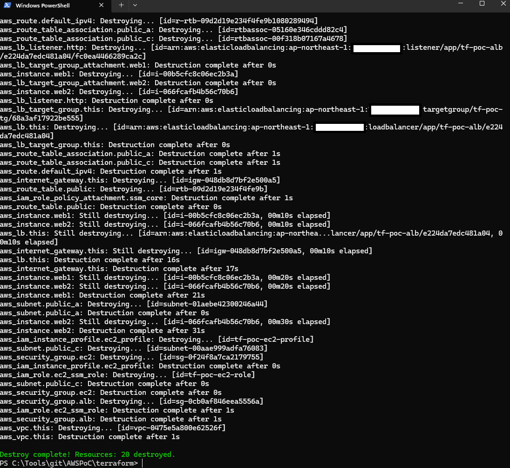

# Terraform 版 検証結果

## 1. 検証目的

手作業で構築した最小 Web 基盤を、Terraform により別 VPC 上へ再現できることを確認しました。

あわせて、以下を検証しました。

- Terraform の構文および構成が正常であること
- 必要な AWS リソースを一括構築できること
- ALB 配下の EC2 2 台へリクエストが分散されること
- user data による初期設定自動化が機能すること
- Terraform State で管理対象を確認できること
- `terraform destroy` により作成したリソースを削除できること

## 2. 実施環境

- Region: `ap-northeast-1`
- Terraform 実行ディレクトリ: `terraform/`
- EC2 OS: Amazon Linux 2023
- Web server: nginx

## 3. 実行コマンド

```powershell
terraform init
terraform fmt -recursive
terraform validate
terraform plan
terraform apply
terraform output
terraform state list
terraform destroy
```

## 4. 確認観点

1. Terraform の初期化、フォーマット、検証、Plan が正常に完了すること
2. Terraform により必要な AWS リソースが作成されること
3. Target Group 配下の EC2 2 台が正常になること
4. ALB の DNS 名から Web サーバーへアクセスできること
5. アクセスを繰り返すと `tf-poc-web1` と `tf-poc-web2` の両方が表示されること
6. EC2 の HTTP 受信元が ALB 用 Security Group に限定されていること
7. EC2 の管理アクセスに SSH ではなく Session Manager を利用できる構成であること
8. 主要リソースが Terraform State で管理されること
9. 検証後に作成リソースを削除できること

## 5. 実施結果

### 5.1 `terraform validate`

`terraform validate` が成功し、構成ファイルが有効であることを確認しました。



### 5.2 `terraform plan`

`terraform plan` を実行し、作成対象と変更内容を事前確認しました。



### 5.3 `terraform apply`

`terraform apply` が成功し、20 リソースが作成されることを確認しました。



### 5.4 `terraform output`

`terraform output` により、構築後の確認に必要な以下の値を取得できることを確認しました。

- `alb_dns_name`
- `public_subnet_a_id`
- `public_subnet_c_id`
- `target_group_arn`
- `vpc_id`
- `web1_instance_id`
- `web2_instance_id`



### 5.5 Target Group の正常性

Target Group に登録した EC2 2 台がともに `healthy` になることを確認しました。



### 5.6 ALB 経由の疎通および負荷分散

`terraform output` で取得した ALB の DNS 名へブラウザからアクセスし、Web ページが表示されることを確認しました。

ブラウザ更新を複数回実施し、`tf-poc-web1` と `tf-poc-web2` の両方が表示されることを確認しました。

| `tf-poc-web1` | `tf-poc-web2` |
|---|---|
|  |  |

これにより、以下を確認しました。

- ALB が HTTP リクエストを受け付けること
- Target Group 配下の EC2 2 台がバックエンドとして機能すること
- user data により各 EC2 の nginx と `index.html` が自動設定されること

### 5.7 Terraform State の確認

`terraform state list` を実行し、以下の主要リソースが Terraform State 上で管理されていることを確認しました。

- VPC
- Public Subnet × 2
- Internet Gateway
- Route Table / Route / Route Table Association
- Security Group × 2
- IAM Role / Instance Profile / Policy Attachment
- EC2 × 2
- ALB
- Target Group / Target Group Attachment
- Listener



### 5.8 `terraform destroy`

検証完了後に `terraform destroy` を実行し、Terraform で作成した 20 リソースが削除されることを確認しました。



## 6. 所要時間

- `terraform apply`: 約 3 分

手作業構築と比較し、コードから同一構成を一括作成できること、および構成を再現しやすいことを確認しました。

## 7. 検証結果まとめ

- Terraform で最小 Web 基盤を構築できること
- 2 つの Availability Zone に EC2 を配置できること
- ALB から Target Group 配下の EC2 2 台へアクセスできること
- Target Group のヘルスチェックで EC2 2 台が正常になること
- user data による EC2 初期設定自動化が機能すること
- Session Manager を前提とした管理構成を定義できること
- 主要リソースを Terraform State で一元管理できること
- `terraform destroy` により構築リソースを削除できること

## 8. 公開時の情報管理

- 画像内の AWS アカウント ID はマスクしています
- リソース ID、ARN、ALB の DNS 名は検証時のものであり、対象リソースは削除済みです
- AWS のアクセスキー、シークレットアクセスキー、セッショントークン、秘密鍵はリポジトリに含めていません

## 9. 今回のスコープと改善候補

本 PoC は構成要素の理解を優先した最小構成です。

- ALB / EC2 ともに Public Subnet に配置
- HTTP のみで、HTTPS は未実装
- CloudWatch Alarm は未実装
- Terraform State はローカル管理

実運用を想定する場合は、Private Subnet、NAT Gateway または VPC Endpoint、HTTPS / ACM、監視、ログ、State のリモート管理、CI などを追加します。
